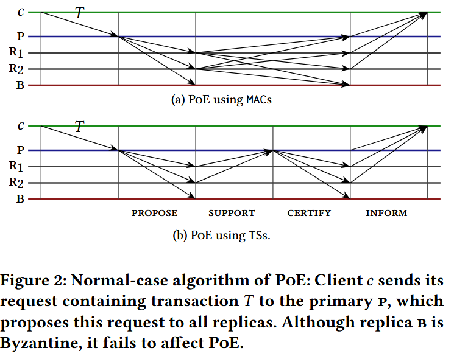
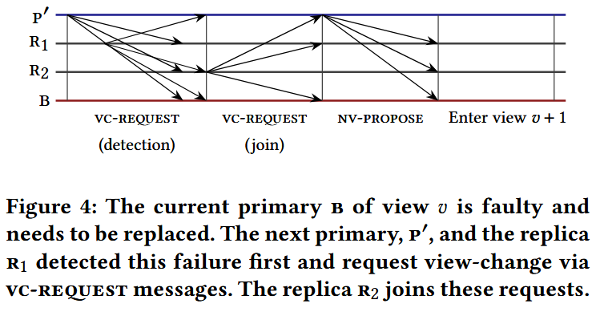
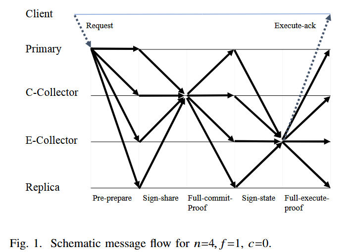

t o 

# 一. Zyzzyva

论文来源：*Zyzzyva: Speculative Byzantine Fault Tolerance*

## 特点

Replicas speculatively execute requests without running an expensive agreement protocol to **definitively** establish the order.

As a result, correct replicas’ states may diverge, and replicas may send different responses to clients.

Because replies carry with them sufficient history information for clients to determine if the replies and history are stable and guaranteed to be eventually committed.

Introduce a new “I hate the primary” phase that guarantees that a correct replica only abandons the current view if it can ensure that all other correct replicas will join the mutiny.

## Model

- `3f + 1` replicas
- Within a view, one replica is designated as the primary responsible for leading the agreement sub-protocol.
- Every replica maintains an ordered history of the requests it has executed and a copy of the max commit certificate. (存储的历史记录中覆盖范围最广的部分。sequence number小于等于的是committed history, 大于的是speculative history)

  ### checkpoint

  - 每隔`CP_INTERVAL`个请求生成checkpoint，向其它副本发送checkpoint消息。当replica收集到`f + 1`个匹配checkpoint消息后，该checkpoint和对应状态快照稳定
  - To bound the size of the history, a replica (1) truncates the history before the committed checkpoint and (2) blocks processing of new requests after processing 2 × `CP INTERVAL` requests since the last committed checkpoint

## 执行过程

1. Client sends request to the replica it believes to be the primary.
2. Primary receives request, assigns sequence number, and forwards ordered request to replicas.
3. Replica receives ordered request, speculatively executes it, and responds to the client.

   Upon accepting the message, replica *i* appends the ordered request to its history, executes the request using the current application state to produce a reply *r*, and sends to client *c* `spec-response`.
4. Client gathers speculative responses.

   - 4(a) Client receives 3f + 1 matching responses and completes the request.
   - 4(b) Client receives between 2f + 1 and 3f matching responses, assembles a commit certificate, and transmits the commit certificate to the replicas.
     - 4(b).1 Replica receives a commit message from a client containing a commit certificate and acknowledges with a local-commit message.
       - 确保其本地历史记录与CC所证明的历史记录一致。如果一致，replica *i* （1）更新max commit certificate （2）sends `local-commit` to *c*.
     - 4(b).2 Client receives a `local-commit` messages from `2f + 1` replicas and completes the request.
   - 4(c) Client receives fewer than `2f + 1` matching `spec-response` messages and resends its request to all replicas, which forward the request to the primary in order to ensure the request is assigned a sequence number and eventually executed.
     - Replica: (1)已经处理过该客户端的这个或更新请求(有缓存)：把缓存的响应重新发给client.  (2)这是一个新请求：向primary发送`confirm-req`，要求primary排序。如果primary正常，会给这个请求分配序号，并发送`order-req`。如果primary不响应，replica的计时器超时后会启动view change
   - 4(d) Client receives responses indicating inconsistent ordering by the primary and sends a proof of misbehavior to the replicas, which initiate a view change to oust the faulty primary. 客户端发现primary作恶，广播proof of misbehavior，导致view change

## View change

1. The Case of the Missing Phase
  - 传统view change的问题：
    f faulty replicas. Primary is one of them. Faulty primary 诱导部分正确replicas放弃当前review。 部分正确replicas沉默，剩余正确replicas数量不足以让client收集到`2f + 1`个commit，发起view change的replica数量不足以让所有replicas切换view。
  - `I hate the primary v` phase:
    If the correct replica *i* suspect the primary of view *v*, it will multicast to all replicas a message `I-HATE-THE-PRIMARY, v`.
    If replica *i* receives `f + 1` 不信任投票，才commit to view change: keep silent and 广播消息，证明`f + 1`个副本都不信任视图v的primary。
    收到view change的正确副本也加入view change
  - 如果有`f + 1`个副本都说不信任primary，至少有一个正确副本不信任。
  - 只要一个正确副本放弃view，最终所有正确副本都会放弃当前view。

2. The Case of the Uncommitted Request
  - 通过commit certificate
    如果请求通过两阶段路径：1. client receives `2f + 1` spec-response.  2. client 组成commit certificate.  3. client receives `2f + 1` local-commit。则至少`f + 1`个正确副本保存了这个commit certificate。
    在view change中，副本会把知道的commit certificate放进view change消息。
    新的primary收集`2f + 1`个view change消息时，至少有一个包含该commit certificate的消息。
  - 通过`3f + 1`个speculative responses
    在view change消息中携带stable checkpoint, 已知的commit certificate，自最新checkpoint或commit certificate以来收到的order-seq
    新primary收集`2f + 1`个view change消息后，构造新的view的历史：对于没有commit certificate的位置，如果某个order-seq出现在至少`f + 1`个view change消息中，那么新primary可以把它纳入新view的历史。

# 二. Zyzzyva5
论文来源：*Zyzzyva: Speculative Byzantine Fault Tolerance*

## 问题
  Zyzzyva最快路径：client收到`3f + 1`个完全匹配的spec-response。
  如果其中某一个出现问题，需要额外两阶段路径：commit, local-commit。

## Model
  - replicas总数改为`5f + 1`，快速路径的quorum从`3f + 1`改为`4f + 1`
  - 慢速路径的quorum依然为`2f + 1`

# 三. PoE(Proof of Execution)

论文来源：*Proof-of-Execution: Reaching Consensus through Fault-Tolerant Speculation*

## 概述
  The primary replica is responsible for proposing transactions requested by clients to all backup replicas. Each backup replica speculatively executes these transactions with the belief that the primary is behaving correctly. Finally, when malicious behavior is detected, replicas can recover by rolling back transactions, which ensures correctness without depending on any twin-path model.

## Model
  - set of replicas `R`, `n = |R|`
  - `nf = |R\F| = n - f`：非故障副本数
  - `n > 3f`, `nf > 2f`
  - Byzantine replicas能相互冒充。使用消息认证码（对称密码学）或门限签名（非对称密码学，私钥、公钥）进行验证
  - a collision-resistant cryptographic hash function `D(·)`

## Normal Case

  - client发送请求：$c$ 对交易 $\tau$签名，发送给当前view的primary。签名防止恶意primary伪造请求。
  - primary提议顺序：分配view内序号$k$，向所有backup广播
  - 副本support有效提议：检查
    - 是否来自当前view的primary
    - view是否正确
    - 自己是否没有接受过view $v$内的第$k$个proposal
    生成签名，把support发回primary
  - primary生成certify：收到$nf$个support后，把这些签名聚合成一个threshold signature，然后把这个certify广播给所有backup
  - 副本view-commit后speculatively execute：把view commit排入执行队列，执行时仍要按照交易顺序，随后向**client**发送inform
  - client形成PoE：client等待来自$nf$个不同副本的相同inform后，认为交易已经执行，并拥有PoE（这个请求在之后的恢复中不能被丢弃）

## View change

  - replica $R$ detects failure of the primary of view $v$, 停止当前view的正常路径，广播vc-request(v, E)，E是该副本已经执行过的交易摘要。检测failure的方式：
    - $R$ timeouts
    - 收到$f + 1$个vc-request
  - 新的primary $p'$(id($p′$) = ($v + 1$) mod $n$)收到$nf$个有效vc-request后，构造nv-propose并广播
  - 副本收到nv-propose后，验证内容，推导新view的交易列表，再rollback，补齐执行，进入新view

# 四. SBFT
来源：*SBFT: a Scalable and Decentralized Trust  Infrastructure*

## Model
  - $n = 3f + 2c + 1$. $c$: 快速路径可额外容忍的崩溃、缓慢副本数，a small common。
  - $\sigma$: 阈值为$3f + c + 1$
  - $\tau$: 阈值为$2f + c + 1$
  - $\pi$: 阈值为$f + 1$
  - $c + 1$ non-primary *C-collectors*(Commit collectors)
  - $c + 1$ non-primary *E-collectors*(Execution collectors)

## Fast Path
  - Pre-prepare
    - client向primary发送带有time的请求；primary积累$b$个请求或timeout是，创建一个decision block
    - primary向所有$3f+2c+1$个副本（包括自己）广播pre-prepare消息
  - Sign-share
    - 满足条件后，副本接受pre-preare消息。
    - 副本$i$计算$h = H(s||v||r)$，并对$h$签名得到$\sigma_i(h)$
    - 发送含有$\sigma_i(h)$的sign-share消息给C-collectors
  - Commit-proof
    - C-collector验证sign-share消息
    - C-collector收到$3f+c+1$份有效sign-share消息后，形成一个组合签名$\sigma(h)$
    - 发送full-commit-proof给所有副本
  - Commit-trigger
    - 副本接受pre-prepare且验证$\sigma(h)$后，接受full-commit-proof

## Execution and Acknowledgement
  - sign-state
    - 副本满足条件后，生成$d = digest(D_s)$，再计算$\pi_i(d)$对$d$签名
    - 发送含有$\pi_i(d)$的sign-state消息给E-collectors
  - Execute-proof
    - E-collector通过对$\pi_i(d)$的验证后，接受sign-state
    - E-collector收到$f+1$个有效sign-state消息后，形成一个组合签名$\pi(d)$
    - 发送full-execute-proof给所有副本
    - 收到full-execute-proof的副本验证后接受
    - E-collector对于每一个请求$o$，在position $l$向client $c$发送execute-ack
    - 当$verify(d, o, val, s, l, P) = true$且$\pi(d)$是有效的，client接受execute-ack，把$o$标记为executed
    - client定时器在收到有效execute-ack前超时，重试请求，并向$f+1$个副本请求常规PBFT风格的确认

## Linear PBFT(Slow Path)
